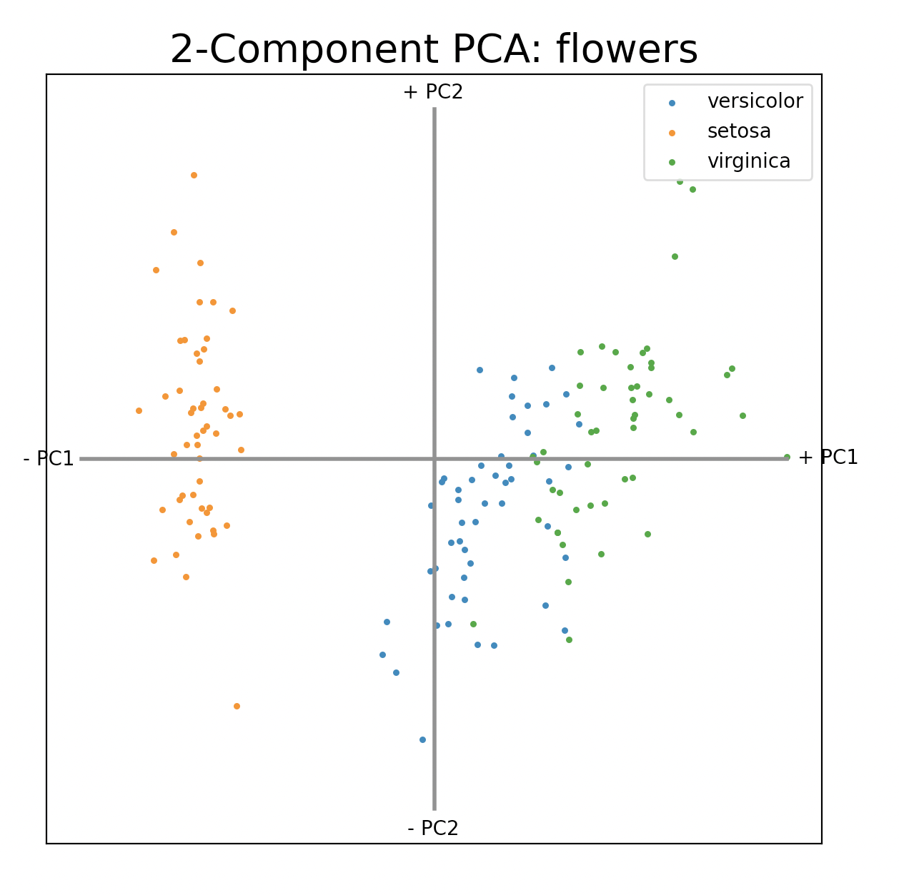

# pca-csv

Run a quick principal component analysis on a CSV file from the command line and create a four-quadrant chart based on CSV data.

## Usage

```pca-csv assets/flowers.csv species```



[CSV from here](https://github.com/vizydrop/data-samples/blob/master/flowers.csv)

## Setup

You will need `python3`.

First, run `./install-prereqs` to make sure you have the required Python dependencies.

Then, move `pca-csv` into a `bin` folder on your PATH so you can execute it from anywhere.

If you don't have a `bin` folder set up already, do:

`mkdir ~/bin`

Then, in your `.zshrc`, add the line:

`export PATH="$HOME/bin:$PATH"`

Then, `mv pca-csv ~/bin`.

Finally, run `source ~/.zshrc`. You should now be able to run `pca-csv` from anywhere.
